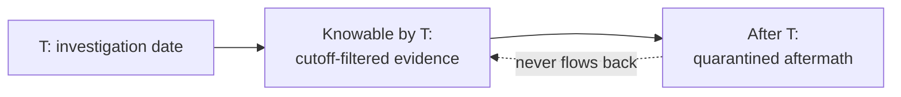
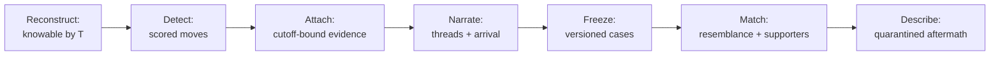
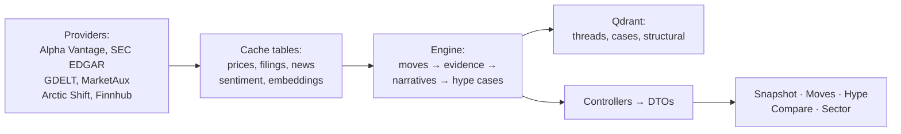
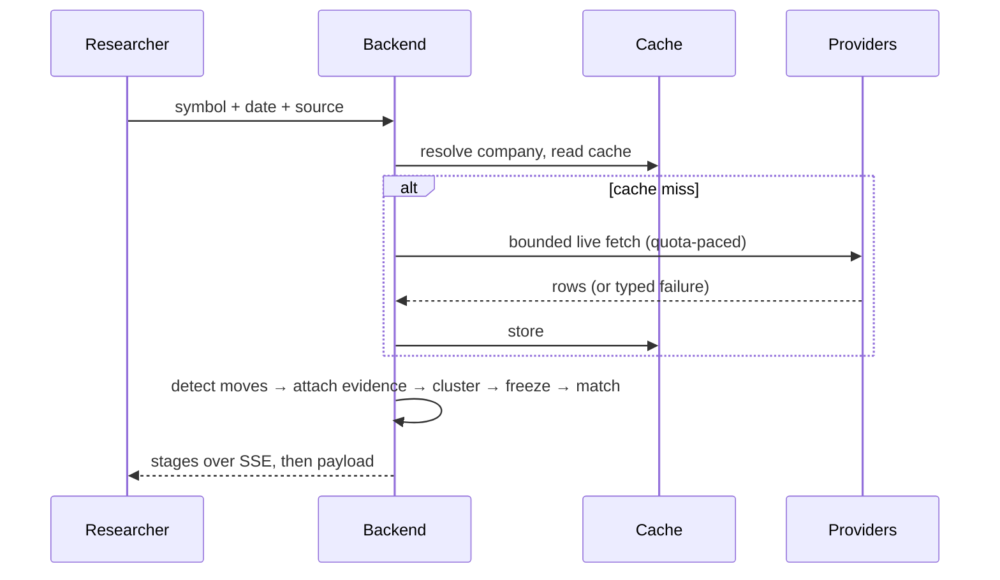

# Stock Time Machine — point-in-time market intelligence

> Every price chart is drawn with knowledge no one had at the time.


Stock Time Machine reconstructs the information environment available up to
a historical cutoff, detects significant price moves and the evidence
available before each one, and checks whether each move's pre-event
information shape occurred before — reporting what followed, descriptively.
It detects patterns and surfaces resemblances. It never predicts, never
recommends, never claims causation.

## The problem: hindsight corrupts retrospective analysis

Financial analysis almost always reasons backward from outcomes. Prices,
filings, threads, and aftermath collapse into a single story told from
today — but nobody standing at any historical date could see what came
next. Explanations written after the fact silently borrow later knowledge:
the filing everyone cites arrived after the decision; the "obvious"
narrative formed weeks later; the empty news day is read as calm instead
of as a coverage gap.

The methodological problem is therefore prior to any model: **before asking
what a historical moment means, establish what was knowable then, with
proof, and keep everything afterward strictly separated.** Most tooling
answers "what happened" from today's vantage point. This system is built to
answer the harder prior question.

## What the system does

Given a company and a historical date, it rebuilds prices, filings, news,
and discussion as knowable up to 23:59 US/Eastern — each item timestamped,
each section cutoff-filtered, each gap marked rather than filled. It detects
the significant moves in the prior window, attaches only the evidence
available before each move, clusters coverage into inspectable narrative
threads, and freezes each move with its information state. It then evaluates
deterministic trigger predicates over those frozen states and compares each
case against stored precedent by structural and semantic resemblance. What
followed precedent cases is reported as recorded closes with aggregates,
collapsed behind a click, disclaimed on every surface.

## Core framework: three moments that must never mix

- **What happened** — recorded prices, filed documents, published coverage.
  The raw material, timestamped per item.
- **What was knowable** — the subset source-timestamped at or before the
  cutoff. Instant cutoffs for true-timestamp rows; calendar-day bounds for
  day-granularity rows (a story dated after the investigation date is
  excluded even when its midnight timestamp precedes the instant cutoff).
- **What followed afterward** — realized prices and later filings, appended
  to quarantined aftermath panels only, never fed back into analysis.

Threads vote only with members dated on or before each peak. Resemblance
pools exclude post-peak members. Supporters must have peaked no later than
the explained peak. The design goal is simple to state and expensive to
implement: hindsight has no code path into the historical state.



Details: [methodology](docs/methodology.md).

## What a researcher can inspect

Not features — the research outputs the system produces, each with its
provenance attached:

- A historical information snapshot at date T, per section, with named
  gaps instead of silent empties
- Significant historical moves with deterministic scores, flags, and
  per-move evidence bounded by that move's own date
- Information-arrival cascades: which layer carried what first, with lags
- Narrative threads with member lists, categories, stored basis, and
  canonical URLs — expandable to the actual articles
- Regulatory evidence with filing dates, proximity tiers, and methodology
  version stamps
- Signal triggers with named evidence (thread titles, sizes, regime spans)
- Historically resembling cases with labeled match kind and supporter lists
- Descriptive aftermath: recorded closes, median/high/low aggregates
- Cross-company thread pairs with cohesion, shared terms, and full
  membership on both sides
- Timestamps, version stamps, and methodology references on everything shown

## Methodology at a glance

**Relevance as gatekeeping, not ranking.** Cached articles pass a tri-state
verdict (relevant / irrelevant / uncertain, AI-first with deterministic
fallback, user verdicts final); only admitted material becomes evidence,
with a full census surfaced. A score of 1.0 means "about this company in
this category" — never "same narrative," which is why lone single-article
threads stay visible but cast no trigger vote.

**Narratives as inspectable clusters.** Admitted articles embed once
(cached per article per model), merge by average linkage, and carry TF-IDF
labels plus majority-vote categories with stored basis. Labels name shared
vocabulary; member lists carry the meaning.

**Patterns as deterministic predicates.** Six triggers over frozen hard
fields (thread categories, price flags, regime paths, sentiment direction),
completeness-gated so missing inputs never read as signal. Detections are
re-derivable by hand from the registry.

**Resemblance as retrieval.** Hybrid case vectors (structural pattern +
content meaning) queried twice — pattern regardless of topic, pattern plus
content — merged with exclusions for same rows, window overlap, future
peaks, and duplicate content. Similarity ranks candidates for researcher
judgment; it proves nothing by itself.

Details: [signals](docs/signals.md) · [analytics](docs/analytics.md) ·
[pipelines](docs/pipelines.md).

## Research and analysis pipeline



Each stage reads the previous stage's stored rows — never re-fetching,
never re-deciding. Full stage-by-stage treatment with rules, formulas, and
failure behavior: [pipelines](docs/pipelines.md).

## Technical architecture

Domain (pure rules: temporal math, windows, triggers, clustering) →
Application (orchestration across interfaces) → Infrastructure (providers,
stores, vectors, jobs) → Web (DTOs). Boundaries are enforced by tests;
nondeterministic or metered externals — model wording, provider responses,
quota states — sit behind interfaces so the deterministic core stays
testable offline. Long runs persist as disconnect-safe jobs and stream
stages over SSE. Details: [architecture](docs/architecture.md) ·
[data](docs/data.md) · [providers](docs/providers.md).



## Request flow (single investigation)



## Engineering properties

These exist to support the methodology, not as ends in themselves: cache
reads before metered fetches with one live retry path per investigation;
adaptive per-provider pacing with typed backoff; vector-store fallback
chain; version-stamped frozen rows; idempotent backfills with table backups;
company resolution that never burns quota on unknown symbols. Each is
documented where it serves the research design, not as a headline.

## Research applications

Retrospective diligence with proof; cited reconstructions of what was
knowable when; compliance review of information boundaries; training that
distinguishes evidence from outcome; pattern libraries of pre-event
conditions; re-running frozen windows as corpora grow (version stamps exist
for exactly this). Empirical claims beyond the observed remain future work —
see [limitations](docs/limitations.md).

## Limitations (abridged)

Corpus holes are real and surfaced, not filled; relevance scores fit, not
narrative; uncertainty is a descriptive proxy, not modeled risk; regimes are
window-relative; AI outputs are labeled and versioned; investigations take
minutes under provider pacing. Full account: [limitations](docs/limitations.md).

## Documentation map

[Overview](docs/overview.md) | [Methodology](docs/methodology.md) |
[Pipelines](docs/pipelines.md) | [Signals](docs/signals.md) |
[Analytics](docs/analytics.md) | [Architecture](docs/architecture.md) |
[Data](docs/data.md) | [Providers](docs/providers.md) |
[Caching](docs/caching.md) |
[Reproducibility](docs/reproducibility.md) | [Testing](docs/testing.md) |
[Limitations](docs/limitations.md) | [Development](docs/development.md)

## Run (plug and play)

The fastest path is Docker — one command brings up SQL Server, Qdrant,
the FinBERT sidecar, the API, and the frontend. The API creates the
database schema itself on first start (with retries while SQL Server
warms up) and reports readiness at `/health/db`, so there is nothing to
provision by hand.

Prerequisites: Docker Desktop running.

```powershell
Copy-Item .env.example .env   # fill in MSSQL_SA_PASSWORD + Qdrant Cloud (see "API keys" below)
docker compose up --build
```

Then open:

| What      | Where                                                                                |
| --------- | ------------------------------------------------------------------------------------ |
| Frontend  | [http://localhost:5173](http://localhost:5173)                                       |
| API       | [http://localhost:8080](http://localhost:8080) (`/` lists the API, `/health` is live) |
| DB health | [http://localhost:8080/health/db](http://localhost:8080/health/db) (200 = ready)     |

First-start notes: FinBERT downloads ~440MB of weights once (cached in a
volume); SQL Server takes ~30s to accept connections (the API waits).
Stop with `docker compose down` (add `-v` to also drop the database and
caches).

## API keys

The app boots without any provider key, but each key unlocks a capability —
without it that capability degrades honestly (empty states, never errors).
Get keys from the sources below and put them in `.env` (Docker),
user-secrets (local dev), or the `stocksapp-secret` Secret (Kubernetes).
Keys stay server-side: never logged, never returned to browsers.

| Key (env)            | Get it at                        | Unlocks                                              |
| -------------------- | -------------------------------- | ---------------------------------------------------- |
| `QDRANT_HOST` + `QDRANT_API_KEY` | [Qdrant Cloud](https://cloud.qdrant.io) (free-tier cluster; host has no scheme) | Hype resemblance (vector index); without it, in-memory fallback |
| `GEMINI_API_KEY`     | [Google AI Studio](https://aistudio.google.com) | AI briefs, embeddings, AI relevance verdicts (else deterministic rule fallback) |
| `JINA_API_KEY`       | [Jina AI](https://jina.ai/reader) | Full article bodies for briefs (else titles only)   |
| `FINNHUB_TOKEN`      | [Finnhub](https://finnhub.io) (free tier) | Live delayed quotes + company-profile fallback      |
| `ALPHAVANTAGE_API_KEY` | [Alpha Vantage](https://www.alphavantage.co) (free tier) | Price history + Alpha Vantage news source |
| `GDELT_API_KEY`      | Required for the Cloud tier (Bearer auth; missing key fails loudly with 503, never falls back) | `gdelt-cloud` news source (`gdelt` is the separate keyless Project source) |
| `MARKETAUX_API_KEY`  | [MarketAux](https://www.marketaux.com) | MarketAux news source                               |

No key is needed for SEC EDGAR — only a contact `SEC_USER_AGENT`, which
defaults sensibly. `MSSQL_SA_PASSWORD` is the one truly required value
(SQL Server refuses to start without it).

Test-only stack (SQL Server + API, NLP off) for backend integration runs:

```powershell
docker compose -f deploy/docker-compose.test.yml up --build
```

Kubernetes: edit the Qdrant host, image names, and secrets under
`deploy/k8s/` (see the header of `deploy/k8s/apply.ps1`), then run
`.\deploy\k8s\apply.ps1` from that directory. The API pod runs a FinBERT
sidecar (no `Nlp:Endpoint` override needed) and is only marked ready when
`/health/db` passes.

## Run (local dev, no Docker)

```powershell
$env:ASPNETCORE_ENVIRONMENT = "Development"
dotnet run --project backend/StockTimeMachine.Web/StockTimeMachine.Web.csproj  # :5251
npm --prefix frontend run dev -- --port 5173 --strictPort
dotnet test backend/StockTimeMachine.Tests/StockTimeMachine.Tests.csproj
```

Keys via user-secrets (never committed); SQL Server local; degrades honestly
without providers. Never overlap `dotnet run` with `dotnet test`. Full
guide: [development](docs/development.md).

**Status: Proof of Concept.**

## Documentation index

| Document | What it covers |
|---|---|
| [Overview](docs/overview.md) | What the system reconstructs and why hindsight separation matters |
| [Methodology](docs/methodology.md) | Knowable-vs-aftermath framework, cutoffs, relevance, resemblance rules |
| [Pipelines](docs/pipelines.md) | Stage-by-stage research pipeline: rules, formulas, failure behavior |
| [Signals](docs/signals.md) | Deterministic trigger catalog (`hs-v1`) and firing conditions |
| [Analytics](docs/analytics.md) | Moves scoring, regimes, uncertainty, sentiment math |
| [Architecture](docs/architecture.md) | Layer responsibilities, boundaries, and honest limitations |
| [Data](docs/data.md) | Cache tables, schemas, retention, frozen rows |
| [Providers](docs/providers.md) | External providers, keys, pacing, degradation behavior |
| [Caching](docs/caching.md) | Cache patterns, invalidation story, quotas, limitations |
| [API](docs/api.md) | Endpoint reference: routes, payloads, SSE events, throttling |
| [Reproducibility](docs/reproducibility.md) | Version stamps, re-runs, byte-identical guarantees |
| [Testing](docs/testing.md) | 461 tests / 38 classes: invariants pinned per area, conventions |
| [Thread clustering](docs/thread-clustering.md) | Average-linkage decision: A/B evidence, traceability, verification |
| [Limitations](docs/limitations.md) | Corpus holes, uncertainty scoping, what the system does not claim |
| [Development](docs/development.md) | Local setup, secrets, scripts, contributor notes |
