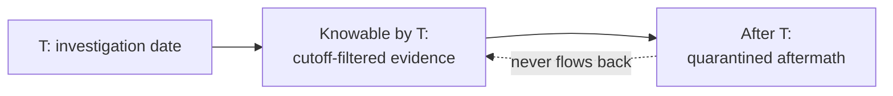
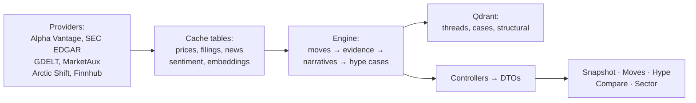
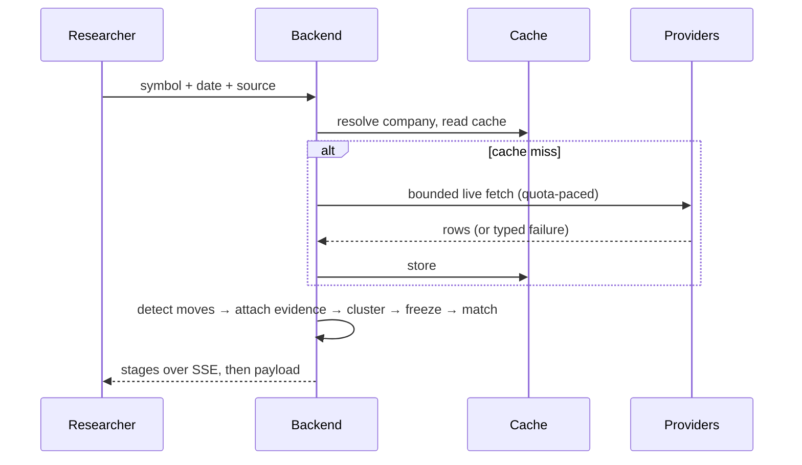

# Stock Time Machine — point-in-time market intelligence

> Every price chart is drawn with knowledge no one had at the time.


---

## Key achievements

### Zero-quota repeat investigations
Article embeddings are cached per article per model. Re-running any
investigation reuses stored vectors instead of re-spending embedding quota —
repeat analysis costs the system nothing.

### One failed fetch covers all moves
A provider outage triggers exactly one live retry path per investigation;
every move then reads the honest result (cached rows or a named unavailable
layer) instead of re-hammering a throttled source.

### Reads never fail on vector outage
Resemblance degrades Qdrant → in-memory join → empty, each step logged.
A dead vector store costs recall quality, never a failed response.

### One limiter paces every provider
A single global adaptive limiter sets per-provider rhythms (Alpha Vantage
12s pacing, GDELT small batches, Gemini 30k tokens/min shared across
embeddings and generation) instead of scattered sleeps. Typed 429s carry
Retry-After backoff with bounded attempts; GDELT day-traversal runs under a
fetch budget so one throttled window can't stall an investigation. Shared
quota waits instead of failing — throttling degrades gracefully by design,
not by accident.

### Day-boundary leakage closed
Day-granularity evidence (filings, GDELT story dates stored as midnight UTC)
used to slip through the end-of-day instant cutoff into the wrong
investigation. Both news reads now apply the calendar-day bound filings
already followed.

### Chained mega-threads split
Single-linkage clustering fused distinct narratives through bridge articles.
Offline A/B measurement selected average linkage at the unchanged threshold;
the same input now resolves into single-narrative threads with honest
singleton non-matches.

### Full suite green in ~2 minutes
The backend suite runs fully offline (InMemory stores, stubbed providers) —
temporal guards, trigger math, merge behavior, and failure paths pinned
without keys, quota, or network.

### Research achievements
- **Re-derivable detections.** Every signal trigger names its threads,
  flags, and regime dates; every resemblance is labeled by which query
  agreed; every brief cites numbered claims. A detection can be checked by
  hand from frozen evidence — no black box to take on faith.
- **Hindsight-proof comparisons.** Supporters must have peaked no later
  than the explained peak; resemblance pools exclude post-peak members;
  future rows never enter historical state. Precedent means precedent.
- **Evidence-backed matching.** Cross-company pairs expose cohesion per
  thread, thread-level mean, shared terms, and full member lists with
  canonical URLs — plus duplicate-content exclusion with counts. Similarity
  is the discovery signal; the member lists are the verdict material.
- **Version-stamped methodology.** Projection, regulatory window, and
  relevance-prompt versions ride on every frozen case, so a later
  re-study can state exactly what changed and what held.

### Business achievements
- **Diligence with proof.** Pre-decision reviews show what was knowable
  before a date, each item timestamped and sourced — the kind of record
  compliance reviews and investment committees ask for and rarely get.
- **Quota economy.** Caching at every layer (prices, filings, articles,
  verdicts, embeddings, summaries) means repeat and comparative analysis
  costs a fraction of first-run spend — the cost structure favors
  re-examination over re-fetching.
- **No-forecast positioning.** The system describes and resembles; it never
  predicts, recommends, or implies causation — in prompts, UI copy, and
  API shapes alike. That restraint is what makes its output usable inside
  regulated workflows.
- **One-cutoff multi-name review.** Sector sweeps evaluate several names
  under a single shared cutoff with failure-isolated rows — a morning
  research routine in one view instead of scattered tabs.

---

## Executive summary

Financial analysis almost always reasons backward from outcomes. Prices,
filings, threads, and aftermath collapse into one story told from today —
but nobody standing at any historical date could see what came next. They
saw information arriving through some channels, with gaps everywhere, in
some order, at some speed.

This project is built around a single distinction most systems blur:
**what happened** vs **what was knowable** vs **what followed afterward**.
Given a company and a date, it reconstructs the information environment
available up to 23:59 US/Eastern — prices, filings, news, discussion — with
proof of what was knowable and what was not. It then detects the significant
price moves in the prior window, attaches only the evidence available before
each one, and checks whether each move's pre-event information shape
occurred before, across frozen historical cases. What followed those
precedents is reported descriptively, collapsed behind a click, disclaimed
on every surface. It detects patterns and surfaces resemblances. It never
predicts, never recommends, never claims causation.

## Why this exists

Retrospective diligence, journalism, compliance review, and researcher
training all share one unserved need: a citable reconstruction of *what
could have been known then*. Existing tools answer "what happened" from
today's vantage point. Explanations written after the fact silently borrow
later knowledge — the filing everyone cites arrived after the decision, the
"obvious" narrative formed weeks later. This system makes that borrowing
structurally impossible: per-item timestamps, cutoff enforcement, quarantined
aftermath, provenance on every item. The moat was never the data (all
public). It is the epistemic discipline.

## Conceptual framework



Three moments that must never mix: **T** (the date picked), **knowable by T**
(everything source-timestamped at or before the cutoff), **after T**
(realized prices, later filings — description only). Threads vote only with
members dated on or before each peak; resemblance pools exclude post-peak
members; supporters must have peaked no later than the explained peak.
Hindsight has no code path into the historical state — several shipped fixes
closed the ones it briefly had (day-boundary leak, future supporters,
post-peak pooling).

## Operationalization

| Research concept | Computational representation | Implementation |
|---|---|---|
| Knowability | Cutoff instant + calendar-day bound | `TemporalBoundary`, `HistoricalDataRepository` |
| Significant move | Weighted z-score/volume/range formula, top 5 | `MoveDetectionService` |
| Material evidence | Tri-state verdicts, AI-first with RULE fallback | `RelevanceService`, `MaterialityRules` |
| Narrative thread | Average-linkage cluster (0.75) + TF-IDF label + majority category | `EmbeddingClustering`, `TopicClustering` |
| Information arrival | Per-layer first-seen instants + lags vs earliest | `ArrivalMap` |
| Regulatory claim | 30-day filing window with proximity tiers (`reg-v1`) | `RegulatoryEvidence` |
| Recurring shape | Six deterministic predicates over frozen cases (`hs-v1`) | `HypeSignals` |
| Precedent resemblance | 3168-d hybrid vectors, dual-query, merged strong/pattern/narrative | `HypeCaseVector`, `HypeResemblanceService` |
| Decision context | Coverage/conflict/instability proxy composite (`dc-v1`) | `DecisionContextCalculator` |
| Fair comparison | Common trading days, indexed to 100, never interpolated | Compare page + sector sweep |

## System overview



Clean Architecture with enforced boundaries: Domain (pure rules) →
Application (orchestration) → Infrastructure (providers, stores, vectors) →
Web (DTOs). Long runs persist as jobs first (disconnect-safe, timeout,
pruned) and stream stages over SSE. Full request flows, per-pipeline rules,
and failure behavior: [pipelines](docs/pipelines.md).

## Request flow (single investigation)



## Project structure

```
backend/StockTimeMachine/        # Domain, Application, Infrastructure
backend/StockTimeMachine.Web/    # Controllers, DTOs, Program
backend/StockTimeMachine.Tests/  # Offline suite (InMemory + stubs)
frontend/src/                    # React pages, components, API client
scripts/                         # harvest, backfill, verify, NLP setup
scripts/nlp/                     # FinBERT sidecar (CPU, pinned revision)
docs/                            # methodology, pipelines, signals, analytics,
                                 # architecture, data, providers,
                                 # reproducibility, testing, limitations
```

## Installation

```powershell
$env:ASPNETCORE_ENVIRONMENT = "Development"
dotnet run --project backend/StockTimeMachine.Web/StockTimeMachine.Web.csproj  # :5251
npm --prefix frontend run dev -- --port 5173 --strictPort
python scripts/nlp/server.py --port 5252   # optional sentiment sidecar
dotnet test backend/StockTimeMachine.Tests/StockTimeMachine.Tests.csproj
```

Keys via user-secrets (never committed); SQL Server local. Runs degraded
without keys or providers — honestly empty, never broken. Never overlap
`dotnet run` with `dotnet test` (the server locks build outputs).

## Limitations (abridged)

Corpus holes are real (entity-anchored coverage misses some names; corpus
starts March 2026); relevance scores fit, not narrative; uncertainty is a
proxy; regimes are window-relative; AI outputs are labeled; investigations
take 10–20 minutes under provider pacing. Full account:
[limitations](docs/limitations.md).

## Research directions this enables

Re-running frozen windows as the corpus grows (version stamps exist for
exactly this); aftermath panels graduating from anecdotes to distributions
at larger case counts; diffusion analysis on the arrival cascades;
cross-name information-structure comparison. The instrument is built;
empirical work is future work.
