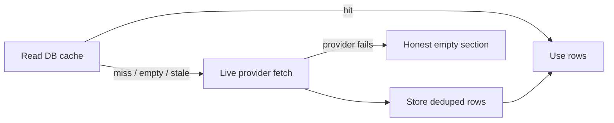
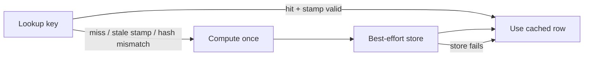
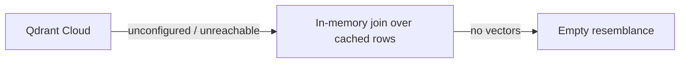

# Caching

Every cache in the system follows from one domain property: **historical
facts are immutable**. Prices, filings, and published articles never
change after the fact, so the database is an append-only permanent cache
that needs no invalidation. Only *derived AI judgments* (verdicts,
vectors, scores, summaries) can go stale — when the model or prompt that
produced them changes — and those are version-stamped. The single
exception is the live quote: the only datum that actually moves, and the
only cache with a TTL.

Patterns in use: cache-aside, read-through memoization, versioned
memoization, content-addressed memoization, write-through index,
refresh-ahead guard, TTL. No distributed cache (single-instance
deployment; see limitations below).

## 1. Persistent fact cache (SQL Server as cache, providers as source)

Prices, filings, and news follow **cache-aside** in `TimeMachineService`
and `MoveDetectionService`: read the database first, live-fetch on
miss/empty/stale, store, re-read.

- Dedupe keys are natural keys: price date, filing accession number,
  article id (a global content hash — the same URL fetched under two
  symbols is stored once, first fetch wins; reads stay
  symbol-partitioned). See `HistoricalDataRepository.StorePrices`,
  `StoreFilings`, `StoreNews`.
- Concurrent writers can race the check-then-insert: `StoreNews` falls
  back to row-by-row insertion, skipping conflicts, so one duplicate
  never voids a batch. Correctness survives the race; the duplicated
  provider spend does not (see §7).
- Live fetches require a CIK-backed identity and are isolated per
  section (`Isolate`): one failing source degrades to an honest
  empty/partial section, never a failed investigation.

## 2. Read-through AI memoization (DB tables as quota ledger)

Repeat investigations must not re-spend metered quota. Each derived
artifact is memoized in its own table; every read is a cache lookup
first, every miss computes once and stores. Cache failures degrade to
miss/recompute — never fatal (`try/catch → miss` at every site).

| Artifact | Table | Key | Invalidation |
|---|---|---|---|
| Embedding vectors | `ArticleEmbeddings` | article + model (`NarrativeService.EmbedCached`) | None — deterministic per model; a model change cleanly misses instead of mixing vector spaces; corrupt rows treated as miss |
| Relevance verdicts | `ArticleRelevances` | article + symbol, stamped `model\|prompt-version` (`RelevanceService.ClassifyAsync`) | **Version-stamp comparison**: stale-model and RULE-placeholder rows are re-judged; precedence USER > AI > RULE; verdicts always apply to the current request even when the store write fails |
| Sentiment scores | `ArticleSentiments` | article + model + **text hash** (`FinBertSentimentAnalyzer.TextHash` over title + description) | Content-addressed — edited text cleanly misses |
| Filing summaries | `FilingSummaries` | accession number (`HypeFilingService.EnsureSummariesAsync`) | None — filing text is immutable |

## 3. Refresh-ahead guard (stale coverage, bounded)

A non-empty cache must not shadow later coverage forever
(`MoveDetectionService.RefreshStaleNews`, mirrored in snapshots): when
the newest cached row is older than `NewsStaleAfterDays` (7) before the
latest move, **one** live refresh runs per investigation. Guards:

- One refresh per symbol+source per investigation (in-request set).
- Throttled source → skip refresh, serve stale cache honestly (a
  refresh would only burn backoff for rows likely unobtainable).
- Per-move fetch-failure guard: a throttled provider is not re-hammered
  for the next move seconds later (empty-but-successful fetches still
  retry per move — different weeks, legitimately different answers).

## 4. TTL cache (live quotes only)

`FinnhubQuoteProvider` holds an `IMemoryCache` with a 60-second TTL per
symbol (Finnhub free tier: 60 calls/minute). This is the only
time-based expiry in the system, placed exactly where time actually
passes. Token stays server-side; failures degrade to null (no quote),
never errors.

## 5. Write-through vector index (Qdrant Cloud)

`HypeCaseIndexer` never freshly embeds: it pools already-cached vectors
(zero quota) and upserts points by stable case id (idempotent —
reindexing never duplicates). Consumers degrade along a fixed chain,
each step logged:

Qdrant is Cloud-only (HTTPS + API key; `Qdrant:Host`/`Qdrant:ApiKey`
required, `Qdrant:Port` defaults to 6334). Without credentials the
store reports unavailable and every consumer takes the fallback — the
index is a rebuildable accelerator, never the source of truth. See
[providers](providers.md).

## 6. Load-once reference data

`JsonCompanyDirectory` (singleton) loads `companies.json` once;
`TemporalBoundary` lazily resolves the Eastern time zone once. Neither
changes at runtime.

## 7. Known limitations (documented, not hidden)

- **No stampede protection.** Concurrent cold investigations for the
  same symbol both miss, both pay provider quota, both embed — dedupe
  saves correctness at write time, not the double spend. A per-key
  single-flight guard around the miss path is the highest-value future
  improvement.
- **Single-instance assumption.** The quote cache is in-process
  `IMemoryCache`; a second API instance needs `IDistributedCache` or
  sticky sessions.
- **No negative caching.** Persistently failing/empty windows cost a
  live attempt per investigation; only the in-request failure guards and
  throttle-aware skip mitigate it.
- **Failure guards are in-request only** (`_newsRefreshed`,
  `_newsFetchFailed`); each request re-learns what the last discovered.

## 8. Tests that pin caching behavior

`HistoricalDataRepositoryTests` (14: dedupe, global article ids),
`RelevanceGateTests` (31: verdict precedence, stale-stamp re-judgment,
store-failure resilience), `AiNarrativeTests` (embedding ceiling,
cache-hit paths), `HypeTests` (indexer paths), `RateLimiterTests` (11).
See [testing](testing.md).

## 9. Documentation map

[Overview](overview.md) · [Methodology](methodology.md) ·
[Pipelines](pipelines.md) · [Signals](signals.md) ·
[Analytics](analytics.md) · [Architecture](architecture.md) ·
[Data](data.md) · [Providers](providers.md) ·
[Reproducibility](reproducibility.md) · [Testing](testing.md) ·
[Limitations](limitations.md) · [Development](development.md) ·
[API](api.md)
