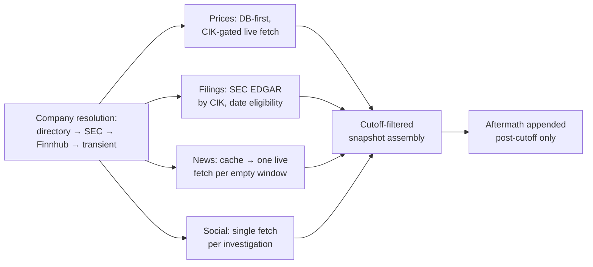
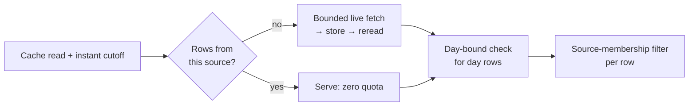
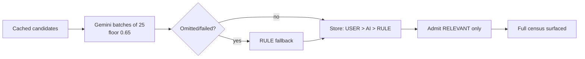
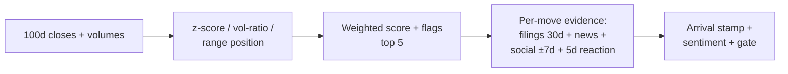
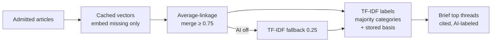
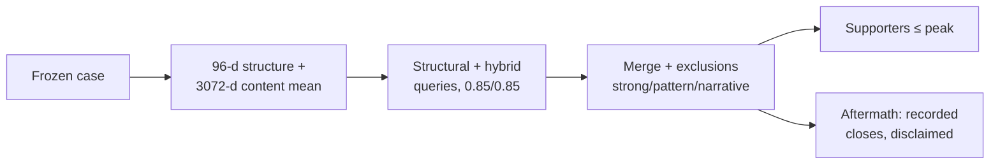

# Pipelines: from research question to running software

How the methodology is actually implemented. Each section states **why the
pipeline exists**, its **inputs as concrete structures**, **every processing
stage in order**, the **rules and decision logic**, **how information changes
representation**, **what is persisted where**, **how failures propagate**,
**where AI judgments end and deterministic code begins**, **what the output
means research-wise (and does not establish)**, and the **code paths** to
trace it. Constants match the implementation verbatim; diagrams compress the
prose, never replace it.

## 1. Point-in-time reconstruction

**Why:** historical analysis routinely reasons backward from outcomes. The
reconstruction pipeline exists so every downstream claim can answer "was
this knowable then?" with a timestamp, not an assertion.

**Inputs:** `(symbol, T, newsSource)`. Company resolution order: curated
directory → SEC EDGAR profile by CIK → Finnhub fallback → transient
unsaved object. Unknown symbols never burn provider quota (live price fetch
requires CIK-backed identity).

**Stages:** resolve company → prices (DB-first; live fetch only on miss) →
filings (SEC EDGAR, date eligibility) → news (cache read, then at most one
live fetch per empty window) → social (single per-investigation fetch) →
snapshot assembly (each section cutoff-filtered) → aftermath appended from
post-cutoff data only.

**Rules:** instant cutoff = T 23:59:59 US/Eastern → UTC; calendar-day bound
(next midnight UTC) for day-granularity rows; per-source membership filters
on every cached row so providers never mix.

**Representation:** provider payloads → `PricePoint` / `SecFiling` /
`NewsArticle` / `SocialSignal` cache rows → cutoff-filtered `Snapshot`
sections → response DTOs.

**Persistence:** all cache rows persist (later stages and investigations
reuse them at zero quota); the snapshot itself is assembled per request.

**Failures:** per-section unavailable markers; one failed layer never
destroys an investigation; throttled sources back off with Retry-After.

**AI vs deterministic:** no AI in this pipeline. Every step is deterministic
given cache state.

**Research meaning:** establishes the knowable-by-T set that everything else
reasons over. Does not establish completeness — corpus holes are real and
surfaced as honest empties, never filled.

**Code:** `TimeMachineService`, `HistoricalDataRepository.GetNewsAsOf`,
`TemporalBoundary`, provider clients under `Infrastructure/News`,
`Infrastructure/MarketData`.



## 2. News ingestion and filtering

**Why:** external coverage must enter without mixing sources, re-spending
quota, or admitting post-cutoff rows.

**Inputs:** cached `NewsArticle` rows (id, title, description, source,
published instant, URL, symbol).

**Stages:** cache read with instant cutoff → if empty for this source, one
bounded live fetch (GDELT: trailing 8 days × 100 rows/day, 120s budget) →
store → reread → per-row source-membership check.

**Rules:** GDELT Cloud day-rows additionally bound by calendar day (a row
dated after T is excluded even though midnight UTC precedes the instant
cutoff); true-timestamp rows (Alpha Vantage, MarketAux) keep the instant
rule. Arctic Shift drops undated items rather than coercing them.

**Representation:** provider JSON → canonical rows keyed by URL-hash id
(same story under two symbols stored once) → source-filtered lists.

**Persistence:** `NewsArticles` table; embeddings cached separately per
article per model.

**Failures:** typed 429s (max 5 attempts); one failed fetch per
investigation covers all moves; fetch failures mark layers unavailable.

**AI vs deterministic:** fully deterministic. No model judges ingestion.

**Research meaning:** defines the observable coverage set. Title-only GDELT
rows and small-cap coverage holes are properties of this set, disclosed
wherever it is shown.



## 3. Relevance gate

**Why:** cached coverage is broad and noisy; only material must become
evidence — but nothing may be silently dropped.

**Inputs:** cached candidates (id + headline).

**Stages:** Gemini classification in batches of 25 (confidence floor 0.65;
omitted ids and failed batches fall back to deterministic RULE keywords,
never unknowns) → verdicts stored with precedence USER > AI > RULE →
gate admits RELEVANT/USER_APPROVED only → full census surfaced
(considered/evaluated/relevant/irrelevant/uncertain).

**Rules:** company mention alone never suffices; no-mention industry/macro
links stay UNCERTAIN (excluded pending review); user approvals are final.

**Representation:** headlines → `ArticleRelevance` rows (decision, source,
category, confidence, reason) → admitted `NewsArticle` set + census numbers.

**Persistence:** verdict rows persist; re-judgment only on prompt-version
bump (`rx-2` stamped per verdict).

**Failures:** AI off/failed → RULE verdicts for the affected batches;
empty verdict map passes everything through explicitly (census shows it).

**AI vs deterministic:** model judges materiality per headline; rules
guarantee totality. The boundary is the batch: model output, rule fallback.

**Research meaning:** defines the evidence set. Scores measure
entity/category fit — 1.0 never means "same narrative," which is why lone
singletons cannot vote alone downstream.



## 4. Sentiment and FinBERT fallback

**Why:** detect when coverage leans against the price move.

**Inputs:** provider per-entity scores; else article texts to the local
FinBERT sidecar (CPU, pinned revision, batch ≤ 32).

**Stages:** provider scores preferred → sidecar for the unscored remainder
(confidence ≥ 0.6 kept, cached per article) → mean vs return sign;
|mean| < 0.1 → neutral; <2 scored articles → unknown.

**Rules:** single scores are noise, never consensus; sidecar down degrades
to provider-only, never to invented scores.

**Representation:** per-article scores → per-move direction
(agree/disagree/neutral/unknown).

**Persistence:** `ArticleSentiments` cache; sidecar stateless.

**Failures:** sidecar unreachable → unknown sentiment for unscored rows;
recorded, never zero-filled.

**AI vs deterministic:** two models (provider sentiment, FinBERT) feed a
deterministic comparison. The rule, not the model, decides the verdict.

**Research meaning:** a contrarian lens for investigation. Assumes scores
measure company-relevant sentiment — true where providers score per-entity,
approximate elsewhere.

## 5. Price and move detection

**Question:** which days moved significantly, described deterministically?

**Inputs:** 100 trading days of closes/volumes (30-row minimum).

**Stages:** z-score vs trailing mean, volume ratio vs trailing median, range
position vs trailing-20d high/low → weighted score → flags → top 5
(harvest override ≤ 20).

**Rules (verbatim):**

```
score = 0.5·min(|z|/3,1) + 0.3·min(max(volRatio−1,0)/4,1) + 0.2·min(rangeBreak·20,1)
```

spike z > 2, plunge z < −2, high-volume volRatio > 2.5, breakout/breakdown
vs trailing-20d extremes.

**Representation:** bars → scored day list → top-5 `KeyMove`s with flags.

**Persistence:** price cache; moves recomputed per investigation (cheap,
deterministic).

**Failures:** thin history yields partial moves, labeled as such.

**AI vs deterministic:** fully deterministic. No model anywhere in scoring.

**Research meaning:** defines the events whose information environments get
reconstructed. Weights are judgmental — documented, not estimated.



## 6. Information arrival

**Why:** show what an investor could have seen *first*, layer by layer.

**Inputs:** one move's cutoff-bound evidence with source timestamps.

**Stages:** first filing date, first article instant, first social post,
move instant → lags measured against the earliest observed layer.

**Rules:** silent layers render unknown, never zero; day-granularity layers
resolve to calendar days (intraday ordering there is unmeasurable).

**Representation:** evidence timestamps → `ArrivalEntry` cascade
(layer, first-seen, lag hours, detail).

**Persistence:** frozen into hype cases; recomputed identically on demand.

**Failures:** empty layer → unknown state, explicitly shown.

**AI vs deterministic:** fully deterministic timestamp arithmetic.

**Research meaning:** ordering in time is observation, not causation. The
cascade answers "what arrived first," never "what caused what."

## 7. Regulatory evidence

**Why:** decide which filings a movement can honestly claim.

**Inputs:** company filings by CIK with calendar filing dates.

**Stages:** select filings within [move − 30d, move] (`reg-v1`) → tier by
proximity: very-close 0–1d, recent 2–7d, older 8–30d → stamp window length
+ version on the frozen case.

**Rules:** proximity only — never importance, never causation; company
history outside the window is not movement evidence.

**Representation:** filings → windowed, tier-counted evidence + arrival
first-seen.

**Persistence:** tier counts and version frozen per case; backfill endpoint
migrates legacy rows idempotently with table backups first.

**Failures:** provider outage marks the layer unavailable; empty window
reads unavailable, never older history.

**AI vs deterministic:** fully deterministic date math. Filing *summaries*
are AI-generated separately and cited as such.

**Research meaning:** temporal eligibility for regulatory claims. Answers
"could this filing have been known before the move," nothing more.

## 8. Narrative construction

**Why:** group coverage into inspectable stories without inventing them.

**Inputs:** relevance-admitted articles with cached 3072-d embeddings.

**Stages:** embed missing vectors (cache-first, zero re-spend) → greedy
agglomerative merging, **average linkage at 0.75** (TF-IDF fallback at 0.25
when AI is off) → TF-IDF labels → majority-vote categories with stored
basis → optional briefs for the largest multi-article threads (cited,
labeled AI).

**Rules:** merge requires mean pairwise cosine ≥ 0.75 (single linkage
retired after measurement showed chain-fused mega-threads); labels name
shared vocabulary, not meaning; briefs narrate only, with per-claim
citations.

**Representation:** articles → vectors → member-id lists → labeled,
categorized, optionally briefed `TopicCluster`s; every thread exposes member
ids for drill-down.

**Persistence:** vectors cached per article per model; threads recomputed
per investigation (deterministic given vectors).

**Failures:** embedding failure → TF-IDF path with disclosed method;
briefing failure → unlabeled thread stands on its own.

**AI vs deterministic:** embeddings decide membership; shared terms name
threads; Gemini narrates briefs under containment (cutoff roleplay,
citation demand, causation/prediction bans). The clustering rule itself is
deterministic math.

**Research meaning:** threads are candidate stories with inspectable
membership — verify against member titles, never trust the label.



## 9. Signal detection and case freezing

**Why:** decide whether pre-peak information shapes recur detectably.

**Inputs:** `MovesWindow` + topics for one investigation.

**Stages:** project each key move (threads filtered by pre-peak overlap;
post-peak members quarantined from pooling) → evaluate six deterministic
predicates over hard fields → freeze matches with trigger evidence into
registry cases surviving job pruning.

**Rules (`hs-v1`):** earnings-chatter (2+ FINANCIAL threads);
regulatory-overhang (multi-article LEGAL/REGULATORY thread + 3+ tense days);
volume-first-divergence (high-volume spike/plunge, ≤2 news, evidence
present); leadership-turbulence (corroborated MANAGEMENT thread);
sentiment-split (news against the move); supply-tremor (SUPPLY_CHAIN +
warming→tense shift). Completeness-gated; lone singletons never vote alone.

**Representation:** window + topics → `HypeCaseDetail` → evaluated matches
→ frozen `HypeCase` rows.

**Persistence:** registry table (append-only in practice; backfills logged).

**Failures:** missing required inputs suppress the trigger (absence never
reads as pattern); unreadable rows skipped loudly in library scans.

**AI vs deterministic:** triggers are pure predicates; AI appears only in
upstream categories/briefs, each labeled.

**Research meaning:** co-occurrence detectors over frozen states. A firing
signal states "this shape was observed," with the evidence list carrying
the nuance — never a forecast or a cause.

## 10. Vectors, resemblance, aftermath

**Why:** ask whether an information shape occurred before, and what
followed — descriptively.

**Inputs:** frozen case (structure fields + admitted-thread vectors).

**Stages:** build 96-d structure (signal weights 3.0/2.0/2.0/1.0/2.0,
bigrams, filing dims) + 3072-d content mean (×4.0), L2-normalize → dual
query (structural pattern + hybrid pattern-content, thresholds 0.85/0.85
from the measured distribution) → merge strong/pattern/narrative →
supporters (same trigger, peak ≤ explained peak) → aftermath aggregates.

**Rules (exclusions):** same cached row, same-symbol 30-day overlap, future
peaks, ≥0.999 duplicate content (counted, never ranked). Fallback chain:
Qdrant → in-memory → empty, each degrading loudly, never failing the
response.

**Representation:** case → 3168-d vector → ranked matches + supporter refs
→ realized closes (median/high/low), collapsed behind click with
disclaimers; DTOs carry no forecast fields, so none can render.

**Persistence:** Qdrant collections (threads/cases/structural) written at
registry time; one-shot reindex for backfill.

**Failures:** unreachable vector store → local join → honest empty.

**AI vs deterministic:** embeddings are model-generated; every comparison,
threshold, exclusion, and aggregate is deterministic math.

**Research meaning:** resemblance is retrieval, aftermath is description.
Same-week macro shocks inflate structural scores (trigger-echo, labeled by
match kind); the small megacap-skewed registry yields anecdotes, not base
rates.



## 11. Cross-company comparison and sector

**Why:** compare names without mixing timelines, verdicts, or sources.

**Inputs:** 2 symbols (compare) or up to 8 (sector), one shared cutoff, one
source.

**Stages:** common trading days only (dropped days counted, never
interpolated) → each series indexed to 100 on the first shared day →
thread pairs with cohesion-A/B, cross mean/max, shared terms, full member
ids + canonical URLs → vocabulary overlap kept as a separate weaker layer →
sector rows run the full pipeline independently with failure-isolated and
explained error rows.

**Rules:** max-pair cosine ≥ 0.70 ranks candidates; duplicates excluded and
counted; no pooled verdicts, rankings, or cross-company causation anywhere.

**Representation:** aligned chart + window stats + pair cards with member
drill-down + per-row peaks/signals/completeness.

**Persistence:** nothing new persisted; reads reuse warmed caches.

**Failures:** unknown symbols get explanatory rows; per-symbol failures
degrade to error rows, never kill the sweep.

**AI vs deterministic:** matching is cosine math; shared-story briefs are
opt-in AI with per-pick citations.

**Research meaning:** co-occurrence and resemblance for researcher judgment.
Shared article ≠ shared narrative ≠ causal relationship — stated on the
page, enforced by keeping the dimensions separate.

## 12. Jobs, streaming, rate limits

Long runs persist as jobs first (disconnect-safe, 60-minute timeout, 7-day
prune) and stream SSE stages. One global adaptive limiter paces providers
(Alpha Vantage 12s, GDELT batches of 2, Gemini 30k TPM shared) with
Retry-After backoff (max 5 attempts); quota, not compute, binds live use.

---

The full chain, one sentence per link: **reconstruct** what was knowable →
**ingest** it without mixing sources → **admit** only relevant material →
**detect** significant moves → **attach** cutoff-bound evidence → **narrate**
it into inspectable threads → **freeze** peaks with their information state
→ **match** the shape against frozen precedent → **describe** what followed,
never what will.
