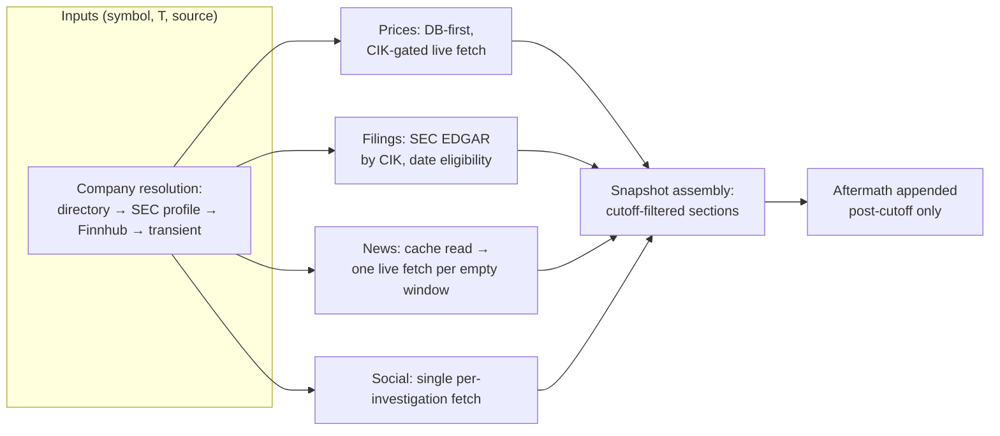
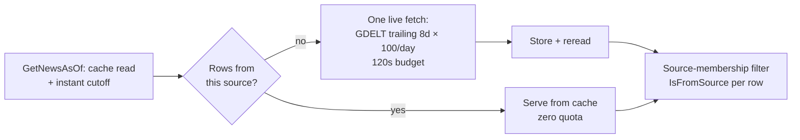
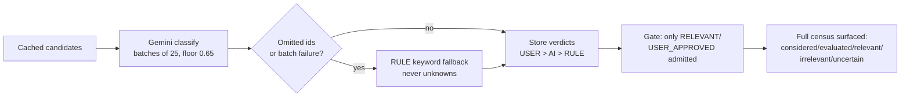
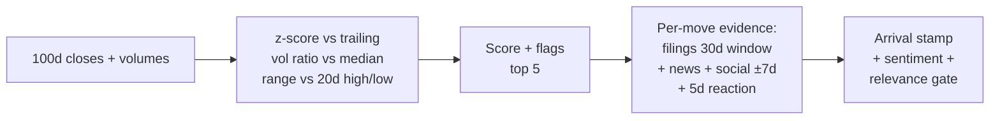
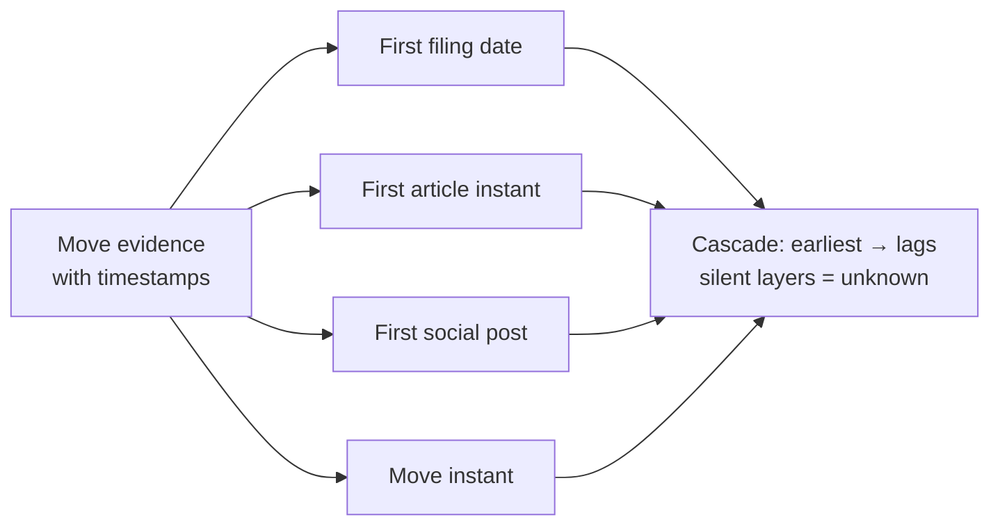
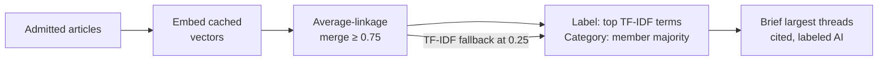
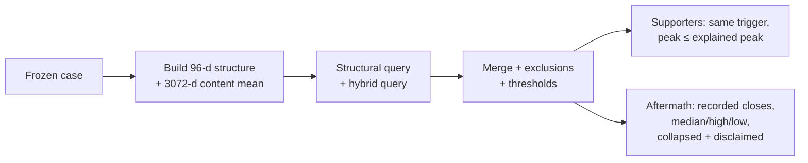

# Pipelines: from research question to running software

How the methodology is actually implemented. Each section follows the same
chain: **research question → concept → operational definition → pipeline →
evidence → output → limitations**, with exact constants from the code and a
diagram of how information is transformed. Numbers source:
[data-snapshot.md](data-snapshot.md).

## 1. Point-in-time reconstruction

**Question:** what was knowable at date T, provably excluding everything after?
**Concept:** three moments — T, knowable-by-T, after-T — enforced architecturally.
**Operational definition:** cutoff = T 23:59:59 US/Eastern → UTC; calendar-day
bound (next midnight UTC) for day-granularity evidence.



**Outputs/persistence:** snapshot DTO + cached rows reused by every
downstream stage at zero quota. **Failures:** per-section unavailable markers;
one failed layer never destroys an investigation. **Limitation:** corpus holes
are real (AAAU verified empty upstream); "available up to a cutoff," never
"exactly as it stood."

## 2. News ingestion and filtering (per provider)

**Question:** how does external coverage enter without mixing sources or
burning quota?
**Concept:** source purity + DB-first discipline + bounded live traversal.



**Per-provider specifics:** GDELT Cloud (entity-anchored stories, title-only,
day rows bound by calendar day); GDELT Project (true timestamps, keyless);
Alpha Vantage (trailing 7-day window, 12s pace, per-entity sentiment);
MarketAux (entity-tagged, descriptions, recent-years free tier); Arctic Shift
(wallstreetbets default, ≤3 subreddits, undated items dropped, never coerced).
**Failures:** 429s typed with Retry-After backoff (max 5 attempts); one failed
fetch per investigation covers all moves. **Limitation:** title-only GDELT
rows; small-cap ETFs uncovered; quota (~100 provider-days per sweep) binds.

## 3. Relevance gate

**Question:** which cached articles may become evidence?
**Operational definition:** tri-state verdict per article (RELEVANT /
IRRELEVANT / UNCERTAIN) + category + confidence + reason, AI-first with
deterministic fallback.



**Limitation:** relevance scores entity/category fit, not narrative fit —
1.0 means "about this company in this category." The 0.85 REGULATORY verdict
on a health story is on record as why lone singletons no longer vote alone.

## 4. Sentiment

**Question:** does coverage lean with or against the price move?
**Operational definition:** provider per-entity scores first; local FinBERT
sidecar (confidence ≥ 0.6) fallback; mean vs return sign with |mean| < 0.1 →
neutral; <2 scored articles → unknown.
**Limitation:** needs scored coverage; assumes per-entity scores measure
company-relevant sentiment. A disagreement is a contrarian lens, never a
prediction.

## 5. Price/move detection

**Question:** which days moved significantly, described deterministically?
**Operational definition:** over a 100-trading-day window (30-row minimum),

```
score = 0.5·min(|z|/3,1) + 0.3·min(max(volRatio−1,0)/4,1) + 0.2·min(rangeBreak·20,1)
```

flags: z > 2 spike, z < −2 plunge, volRatio > 2.5 high-volume, trailing-20d
breakout/breakdown. Top 5 moves (harvest override ≤ 20).



**Limitation:** fixed weights are judgmental; top-5 truncates; thin-history
windows yield partial moves.

## 6. Information arrival

**Question:** what could an investor have seen *first*?
**Operational definition:** per-layer first-appearance instant within the
move's evidence; lags measured against the earliest observed layer.



**Limitation:** day-granularity layers resolve to calendar days; intraday
ordering within GDELT/filings is unmeasurable; ordering is observation, not
causation.

## 7. Regulatory evidence

**Question:** which filings can a movement honestly claim?
**Operational definition:** only filings filed within [move − 30d, move]
(`reg-v1`), tiered very-close (0–1d) / recent (2–7d) / older (8–30d) by
proximity alone. Every frozen case stamps window length + version.
**Limitation:** proximity is not importance or causation; company history
outside the window is never movement evidence.

## 8. Narrative construction (threads)

**Question:** what stories was coverage telling?
**Operational definition:** relevance-admitted articles embedded (Gemini
3072-d, cached per id/model) → greedy agglomerative clustering, **average
linkage at 0.75** → TF-IDF labels → majority-vote categories with stored
basis → optional AI briefs (top-8 multi-article threads).



Single linkage was retired after measurement (166-article blob, median
pairwise 0.70, 81% below bar); threshold tuning on it proved futile; the
post-pass reproduced average linkage bit-for-bit. Singleton threads are
honest non-matches. Every thread exposes its member ids for drill-down.
**Limitation:** embeddings see titles only for GDELT rows; briefs narrate
only briefed threads; categories can misfire (singletons fenced out of
trigger votes for exactly this reason).

## 9. Signal detection + case freezing

**Question:** do pre-peak information shapes recur detectably?
**Operational definition:** each key move frozen with threads, regimes,
sentiment, evidence counts (`hcp-v1`); six deterministic predicates
(`hs-v1`) over hard fields only, completeness-gated, corroborated
(lone singletons never vote alone).


**Limitation:** one investigation's thread pool is shared across its peaks
(by design); predicates see categories, not events — the evidence list, not
the firing, carries the nuance.

## 10. Vectors, resemblance, aftermath

**Question:** has this information shape occurred before, and what followed?
**Operational definition:** 3168-d hybrid vector (96 structural dims with
weights 3.0/2.0/2.0/1.0/2.0 + 3072 content dims ×4.0, L2-normalized).
Dual-query retrieval: structural (pattern regardless of topic) + hybrid
(pattern + content), thresholds 0.85/0.85 from the measured distribution,
merged strong/pattern/narrative. Exclusions: same cached row, same-symbol
30-day overlap, future peaks, ≥0.999 duplicate content (counted, never
ranked). Fallback: Qdrant → in-memory → empty.



**Limitation:** same-week macro shocks inflate structural similarity
(trigger-echo); 130 megacap-skewed cases are anecdotes, not base rates.

## 11. Cross-company comparison + sector

**Question:** how do two names (or eight) differ under one cutoff?
**Operational definition:** common trading days only (dropped days counted,
never interpolated), each series indexed to 100 on the first shared day;
thread pairs with cohesion-A/B, cross mean/max, shared terms, full member
ids + canonical URLs; vocabulary overlap kept as a separate weaker layer;
sector rows run the full pipeline independently with failure-isolated error
rows and an 8-symbol cap.
**Limitation:** shared article ≠ shared narrative ≠ causal relationship;
no pooled verdicts by design.

## 12. Jobs, streaming, rate limits

Long runs persist as jobs first (disconnect-safe, 60-minute timeout, 7-day
prune) and stream SSE stages. One global adaptive limiter paces providers
(Alpha Vantage 12s, GDELT batches of 2, Gemini 30k TPM shared) with
Retry-After backoff; quota, not compute, binds live use.

---

The full chain, in one sentence per link: **reconstruct** what was knowable
→ **ingest** it without mixing sources → **admit** only relevant material →
**detect** significant moves → **attach** cutoff-bound evidence → **narrate**
it into inspectable threads → **freeze** peaks with their information state
→ **match** the shape against frozen precedent → **describe** what followed,
never what will.

