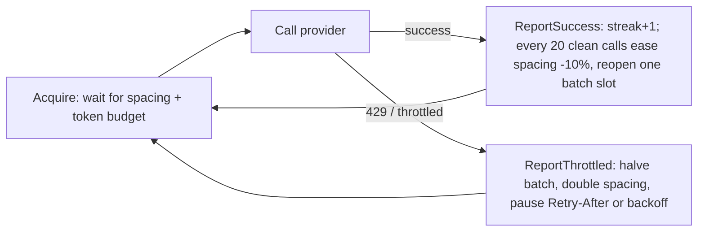
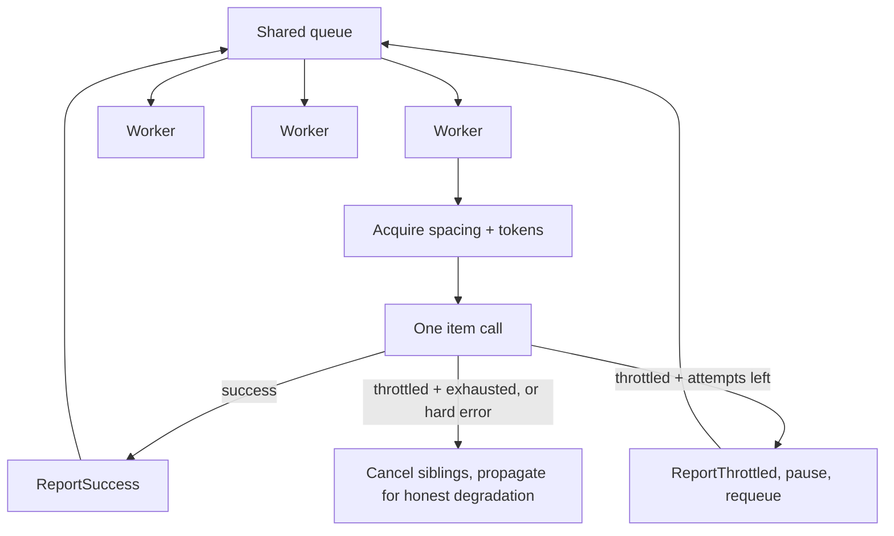

# Rate limiting

One mechanism for every outbound call: `AdaptiveRateLimiter`, one instance
per named scope, process-wide (`RateLimiterRegistry`). Each scope combines
inter-request spacing with a token bucket (for metered model endpoints)
and AIMD adaptation: 429s shrink the rhythm, sustained success recovers it
gradually. Pending work waits — never drops, never duplicates. Throttling
never changes response shapes; sections degrade to honest empty states
(see [providers](providers.md)).

## 1. Scopes and policies

A scope is one rate-limited world (a provider, or one Gemini endpoint —
embed vs generate limits differ, so each gets its own limiter). Policies
come from `RateLimits:{scope}` config; code defaults are zero-delay so
tests stay fast and hermetic, and the production rhythm lives in
`appsettings.json` (legacy per-provider keys still override where they
exist).

| Scope | Used by | Code default (batch / delay) | Production rhythm (batch / delay / TPM) |
|---|---|---|---|
| `gdelt` | GDELT Project, GDELT Cloud, resilience wrapper | 1 / 0ms | 2 / 3000ms |
| `alphavantage` | Prices, AV news | 1 / 12s (`AlphaVantage:PaceSeconds`) | 1 / 12s |
| `marketaux` | MarketAux news | 2 / 0ms | 2 / 1000ms |
| `arctic` | Arctic Shift social | 1 / 0ms | 1 / 1500ms |
| `jina` | Article bodies | 2–4 / 0ms | 4 / 2000ms |
| `gemini-embed` | Embeddings | 2–4 / 0ms, 30k TPM | 4 / 1000ms, 30k TPM |
| `gemini-generate` | Briefs, verdicts, Q&A | 1–2 / 0ms, 30k TPM | 2 / 4000ms, 30k TPM |

Common bounds for every scope: batch 1–4 start, spacing 250ms–30s,
backoff capped at 60s, 5 attempts per item, 20 clean calls to recover a
step. `RateLimiterRegistry.Reset()` exists for tests/hosts sharing a
process; `TryGet` is a non-creating read so throttle-aware callers never
fabricate limiter state.

## 2. The AIMD loop

- Spacing serializes rhythm across concurrent traffic (`_lastCallUtc`
  stamp under lock); the token bucket refills continuously
  (`TPM/60` per second, capped at one minute's budget).
- `Retry-After` (delta-seconds or HTTP date, shared parser
  `RateLimitHeaders`) wins when the server asks; otherwise exponential
  backoff from current spacing, capped at `MaxBackoffMs`.
- Recovery never jumps: after a throttle, spacing only eases 10% per 20
  clean calls and batch reopens one slot at a time.

## 3. Batched embeds (bounded-parallel workers)

`ExecuteBatchAsync` (used by Gemini embeds) sizes workers to the *live*
batch size and spaces every start through `Acquire`, so bursts are
impossible even as recovery reopens slots:

Items leave the queue only on success — no request is lost or
duplicated; after `MaxAttempts` (or any non-throttle error) siblings
cancel and the error propagates for the caller to degrade honestly.

## 4. Token weights (paying in the model's currency)

Model calls acquire estimated tokens, not just slots
(`EstimateTokens`: `max(1, chars/4)`), plus fixed overhead buffers per
call shape (generate paths add +512/+768/+1024 for the expected
completion). The bucket therefore paces *spend*, while batch size paces
*concurrency* — two independent throttles for two independent limits.

## 5. Per-provider wiring

| Provider | Scope | Pattern |
|---|---|---|
| GDELT Project / Cloud | `gdelt` (shared) | Acquire per day-fetch; `GdeltResilience` wrapper reports success/throttle centrally; per-day failure degrades to the other days, never the window |
| Alpha Vantage (prices + news) | `alphavantage` | 12s pacing per call; throttles feed the shared rhythm; daily-limit 429s not retried; `outputsize=full` premium-denial retries once as `compact` |
| MarketAux | `marketaux` | Acquire per call; success/throttle reported; daily-limit 429s not retried |
| Arctic Shift | `arctic` | Acquire per call; deliberately never retried (durable per-IP throttle); single spaced fetch per investigation |
| Jina Reader | `jina` | Acquire per call; fail-soft per call with stored-text fallback |
| Gemini embeds | `gemini-embed` | `ExecuteBatchAsync` with token-weighted acquires |
| Gemini generate | `gemini-generate` | Token-weighted acquire per call; success/throttle reported per call shape |

Throttle-aware callers read limiter state without creating it:
`MoveDetectionService` skips the stale-news refresh when its source
scope shows recent 429s — a refresh would only burn backoff for rows
likely unobtainable.

## 6. Call-site quota caps (the outer budget)

The limiter paces *rate*; call sites bound *volume* per investigation:
fetch windows are 7 trailing days per provider call (never open-ended);
relevance expansion is capped at 8 queries; briefing covers the largest
8 threads with at most 3 fetched bodies each; embeddings cap at 400
articles; harvest caps top-N moves; sector sweeps cap at 8 symbols.
Rate × volume is therefore bounded on both axes.

## 7. Tests

`RateLimiterTests` (11: pacing, batching, backoff, recovery),
`GdeltResilienceTests` (5), `ProviderFixtureTests` (22: timeouts,
`IsConfigured` gates), plus 429/timeout paths across the provider
suites. See [testing](testing.md).

## 8. Documentation map

[Overview](overview.md) · [Methodology](methodology.md) ·
[Pipelines](pipelines.md) · [Signals](signals.md) ·
[Analytics](analytics.md) · [Architecture](architecture.md) ·
[Data](data.md) · [Providers](providers.md) ·
[Caching](caching.md) · [API](api.md) ·
[Reproducibility](reproducibility.md) · [Testing](testing.md) ·
[Thread clustering](thread-clustering.md) ·
[Limitations](limitations.md) · [Development](development.md)
